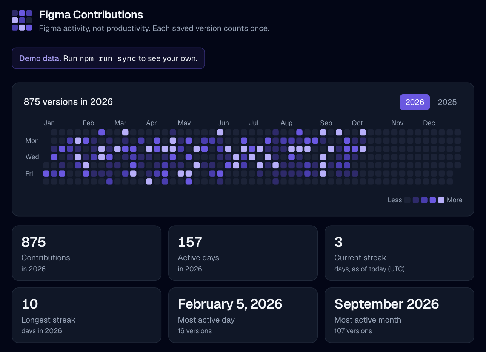

# Figma Contributions

GitHub's contribution graph, for Figma. A local-first, open-source app that turns your Figma files' version history into a contribution heatmap with streaks and per-project stats.

> Measures Figma **activity**, not productivity. 10 versions ≠ 10 hours of work.

<picture>
  <source media="(prefers-color-scheme: light)" srcset="docs/screenshots/light.png">
  
</picture>

<sub>Screenshot uses the bundled demo data.</sub>

## Why it exists

Developers get a picture of their work over time for free on GitHub. Designers don't: Figma has version history, but no way to see a year of activity at a glance, across files. This project builds that picture from the version history Figma already keeps, on your own machine, without a server, an account system or sending your data anywhere but Figma's own API.

## Features

- **Heatmap:** a GitHub-style year grid, one cell per day, five intensity levels, tooltips, month and weekday labels.
- **Several files, one graph:** list as many files as you like; branches work too.
- **Only your work:** versions made by teammates in shared files are not counted.
- **Stats:** total contributions, active days, current and longest streak, most active day and month.
- **Most active projects:** versions per file for the selected year.
- **Year navigation:** any year from your first synced year to now, including empty ones.
- **Fast re-syncs:** after the first sync, only new versions are fetched, usually one request per file.
- **Dark and light themes**, responsive down to 320px, keyboard and screen reader accessible.
- **Demo mode:** with no synced data, the app shows made-up data, which is what a public deployment shows.

## Architecture

```text
npm run sync                                   npm run dev / build
────────────                                   ───────────────────
.env.local ──► scripts/sync.ts                 src/app/page.tsx
                 │                               │  reads data/contributions.json
                 ▼                               │  (or data/demo.json if missing)
          src/lib/figma        ◄── Figma REST    ▼
          (client, versions,       API      src/lib/contributions
           fileKeys)                        (levels, stats, calendar, years)
                 │                               │
                 ▼                               ▼
          src/lib/sync.ts  ──►  data/contributions.json  ──►  heatmap + stats
```

- **The Figma API is only called by `npm run sync`**, never when the page renders. The token is only read by the sync script.
- **Storage is one JSON file**, `data/contributions.json`: daily version counts per file, plus a bookmark per file for incremental syncs. Levels, streaks and stats are computed when the page loads, so changing them never needs a re-sync.
- **Dates are UTC calendar days.**

| Path | What it does |
|---|---|
| `scripts/sync.ts` | Reads config, runs the sync, writes the data file, prints a summary |
| `src/lib/sync.ts` | The sync pipeline: fetch, keep your versions, count per day, merge with the last sync |
| `src/lib/figma/` | Figma API client (errors, retries, rate limits), version paging, file key/URL parsing |
| `src/lib/contributions/` | Daily counts, levels, stats, project ranking, year calendar, year selection |
| `src/app/` | The page, loading and error states, theme (`globals.css`) |
| `src/components/` | Heatmap, stats, projects list, header |
| `data/demo.json` | Made-up demo data (committed) |
| `docs/` | [Roadmap](docs/roadmap.md) and [project definition and decisions](docs/phase-1.md#31-phase-1-decisions-resolved-gaps) |

## Requirements

- **Node.js 22.18 or newer**: the sync script and tests run TypeScript directly with Node.
- **A Figma account** with access to the files you want to count.
- **A Figma personal access token** (setup below).

## Installation

```bash
git clone https://github.com/sawmeerdesigns/Figma-Contributions.git
cd Figma-Contributions
npm install
cp .env.example .env.local
```

Fill in `.env.local` (next two sections), then:

```bash
npm run sync
npm run dev    # http://localhost:3000
```

## Configuration

Everything lives in `.env.local`, which is gitignored:

```env
FIGMA_ACCESS_TOKEN=figd_...
FIGMA_FILE_KEYS=https://www.figma.com/design/AbC123xyz/My-File, DeF456
```

Only `npm run sync` reads this file (through Node's `--env-file-if-exists`). The Next.js app never sees the token. **Never** rename these variables with a `NEXT_PUBLIC_` prefix: Next.js would ship the token to every visitor's browser.

### Figma token setup

1. In Figma, open **Settings → Security → Personal access tokens**.
2. Click **Generate new token** and give it these read-only scopes:

   | Scope | Needed? | Why |
   |---|---|---|
   | `file_versions:read` | Required | Reads each file's version history |
   | `current_user:read` | Required | Identifies you, so teammates' versions aren't counted |
   | `file_metadata:read` | Optional | Uses each file's current name from Figma. Without it, names come from the file URL you pasted |

3. Copy the token (it starts with `figd_`) into `FIGMA_ACCESS_TOKEN`. Figma only shows it once.

Tokens expire, after at most 90 days. When sync reports an authentication error, generate a new one. Figma doesn't let you add scopes to an existing token, so changing scopes also means a new token.

### File key setup

`FIGMA_FILE_KEYS` lists the files to count, separated by commas (spaces and new lines work too). Each entry is either a **pasted file URL** or a **bare key**, which is the part of the URL after `/design/`:

```text
https://www.figma.com/design/AbC123xyz/My-File
                             ^^^^^^^^^
```

- **Pasting the full URL is easiest.** It also gives the file its display name ("My-File" becomes "My File") when the token lacks `file_metadata:read`.
- **Branch URLs** (`…/branch/<key>/…`) count the branch's own history.
- **Listing a file twice** (as a key and as a URL) counts it once.
- **New files aren't found automatically.** Add them to the list.
- **Older setups:** a `.env.local` with a single `FIGMA_FILE_KEY` still works.

## Syncing

```bash
npm run sync            # fetch new versions and update the data
npm run sync -- --full  # rebuild everything from Figma's full history
```

A sync looks like this:

```text
✓ Configuration loaded (2 files)
✓ Authentication successful

Fetching version history (your versions / all versions)...
✓ Mobile App (AbC123xyz): +3 / 4 new
✓ Design System (DeF456): +0 / 0 new
✓ Activity processed
✓ Contributions generated

Total versions by you: 238 (3 new this sync)
Figma API requests: 4
...
```

- **What counts:** every entry in a file's version history counts as one contribution, on its UTC date. That includes both named versions and autosaves.
- **First sync** fetches each file's full history.
- **Later syncs** only fetch versions newer than the last sync and add them, usually one request per file. Days already synced are kept even if Figma later stops returning them, for example because of a plan's history limit.
- **When sync fetches everything instead:** for files new to the list, after the token's owner changes, or with `--full`. `--full` only has what Figma still returns, so it can drop old days that incremental syncs kept.
- **Removed files:** taking a file out of `FIGMA_FILE_KEYS` removes it from the data on the next sync.
- **Nothing is half-written:** if any file fails, the sync stops and the previous data stays as it was.
- **Rate limits:** sync is sequential, waits out short rate limits (up to 60 seconds, 3 retries) and reports longer ones.

### Contribution levels

| Versions per day (UTC) | Level |
|---:|---:|
| 0 | 0 |
| 1–2 | 1 |
| 3–5 | 2 |
| 6–9 | 3 |
| 10+ | 4 |

Thresholds live in `getLevel` (`src/lib/contributions/calculate.ts`). They're applied when the page loads, so changing them doesn't need a re-sync.

## Development

| Command | What it does |
|---|---|
| `npm run dev` | Dev server at http://localhost:3000 |
| `npm test` | Unit tests (Node's built-in test runner, Figma API stubbed, no token needed) |
| `npm run typecheck` | Generates Next.js route types, then runs `tsc` |
| `npm run lint` | ESLint |
| `npm run build` / `npm start` | Production build and server |
| `npm run sync` | Sync with Figma (needs `.env.local`) |

- **CI** (`.github/workflows/ci.yml`) runs test, typecheck, lint and build on every push and pull request.
- **Demo mode:** with no `data/contributions.json`, the page uses `data/demo.json`. Move your file aside to see the demo.
- **Next.js version:** the project uses Next.js 16, whose APIs differ from older versions. See [AGENTS.md](AGENTS.md).
- **Tests sit next to the code they cover** (`*.test.ts`). The contrast test (`src/app/contrast.test.ts`) fails if a theme color drops below WCAG AA.

## Troubleshooting

| Message or symptom | Fix |
|---|---|
| `FIGMA_ACCESS_TOKEN is missing` / `FIGMA_FILE_KEYS is missing` | Create `.env.local` from `.env.example` and fill it in. |
| `FIGMA_FILE_KEYS: "…" doesn't look like a Figma file key or file URL` | Check each entry is a key or a `figma.com/design/…` URL, separated by commas. |
| `Your token can't read your Figma user (403)` | The token lacks `current_user:read`. Generate a new one with both required scopes. |
| `Figma rejected the request (401)` or `(403)` for a file | The token is wrong or expired, lacks `file_versions:read`, or your account can't open that file. The message quotes Figma's reason. |
| `Figma file not found (404)` | The key is wrong (copy it from the file URL), or the file was deleted. |
| `Figma rate limit reached (429)` | Wait for the time shown and run sync again. |
| `Could not reach the Figma API` | You're offline, or Figma didn't answer within 30 seconds. Try again. |
| `Figma sent a response that isn't valid JSON` | Usually a temporary Figma problem. Try again later. |
| `Names come from your file URLs…` | Informational. Add the optional `file_metadata:read` scope for Figma's current file names. |
| Sync shows `67 / 69`, not every version | Expected: the rest were made by other people. |
| The page shows "Demo data" | No `data/contributions.json` yet. Run `npm run sync`. |
| The page says "Couldn't load your contributions" | The data file is broken or from an older version. Run `npm run sync -- --full`. |
| New Figma work doesn't show | Run `npm run sync` again; the page only shows what was synced. |
| A day looks off by one | Days are UTC. Late-evening work west of UTC lands on the next day. |
| `Another next dev server is already running` | Next.js 16 allows one dev server per project. Use the one it names, or stop it first. |
| Counts look wrong after changing the file list or token | Run `npm run sync -- --full`. |

## Privacy

- **Your token** stays in `.env.local` on your machine. It's only sent to `https://api.figma.com`. The client refuses to send it anywhere else, even if a response points elsewhere.
- **Your data** (`data/contributions.json`) stays on your machine and is gitignored. It holds file keys, file names, your Figma user ID, daily version counts and sync bookmarks. It never contains file contents.
- **No servers or analytics.** This project has no backend, accounts or tracking of its own. Note that Next.js itself collects anonymous telemetry by default; run `npx next telemetry disable` to turn it off.
- **Public deployments** use `data/demo.json` (made-up projects and counts), never a real token or real data.
- **Sharing screenshots** shows your file names and activity. To show the app publicly, use the demo data.

## Contributing

Issues and pull requests are welcome. Before opening a PR, run `npm test`, `npm run typecheck`, `npm run lint` and `npm run build`; CI runs the same checks. The [roadmap](docs/roadmap.md) shows what's planned, and [phase-1 §31](docs/phase-1.md#31-phase-1-decisions-resolved-gaps) records past decisions and why. Full contribution guidelines come with roadmap Phase 18.

## License

[MIT](LICENSE). The LICENSE file itself is added with roadmap Phase 18 (open-source readiness).
