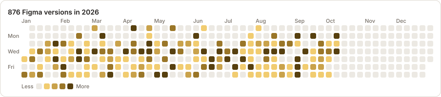

# Add your calendar to a portfolio

Export just the contribution calendar as one image and put it anywhere: your portfolio site, a GitHub profile, Notion, Framer, Webflow, or a Figma file.

<picture>
  <source media="(prefers-color-scheme: dark)" srcset="screenshots/embed-dark.svg">
  
</picture>

<sub>Example made from the bundled demo data.</sub>

## Contents

- [How it works](#how-it-works)
- [Export your calendar](#export-your-calendar)
- [Options](#options)
- [Where to use it](#where-to-use-it)
- [Keep it up to date](#keep-it-up-to-date)
- [Auto-update with GitHub Actions](#auto-update-with-github-actions)
- [Privacy: what you're publishing](#privacy-what-youre-publishing)
- [Troubleshooting](#troubleshooting)

## How it works

```text
npm run sync     →  data/contributions.json   (your real activity, stays on your machine)
npm run export   →  data/contributions.svg    (just the calendar, ready to publish)
```

The export is a single SVG file: a plain image you can scale to any size without blurring. It's the same calendar the app shows, in the same colors, but with nothing else:

- **Included:** one cell per day, month and weekday labels, a legend, and a title like "236 Figma versions in 2026".
- **Not included:** stats, project names and file keys.

Each cell has a tooltip ("4 versions on Tuesday, September 29, 2026") in browsers that show SVG tooltips. The whole image has an accessible title and summary.

> **Static or self-updating?** An export is a snapshot: it changes when you export again. For a calendar that updates itself every day, turn on the [GitHub Action](#auto-update-with-github-actions) and point your portfolio at its image URL. (The public demo deployment can't do this: it only ever shows made-up data, so nobody's real activity gets published by accident.)

## Export your calendar

1. Set up and sync as described in the [README](../README.md#installation), so `data/contributions.json` exists.
2. Export:

   ```bash
   npm run export
   ```

   ```text
   ✓ data/contributions.svg: 2026, 236 versions, auto theme
   ```

3. Open `data/contributions.svg` in your browser to check it, then use it wherever you like ([examples below](#where-to-use-it)).

To try it before syncing, export the demo data: `npm run export -- --demo`.

`data/*.svg` is gitignored, so an export of your real data isn't committed to this repository by accident.

## Options

Pass options after `--`:

```bash
npm run export -- --year 2025 --theme dark --transparent --out ~/Desktop/figma-2025.svg
```

| Option | Default | What it does |
|---|---|---|
| `--year 2025` | Your latest year with activity | Which year to draw. Any year from 2016 up to now. |
| `--theme auto` | `auto` | `auto` follows the viewer's light/dark setting. `light` or `dark` fixes the colors. Use a fixed theme for Figma, Framer and other design tools (see below). |
| `--transparent` | off | Removes the card background and border, so the calendar sits on your page's own background. Pick a `--theme` that matches that background. |
| `--out file.svg` | `data/contributions.svg` | Where to write the file. |
| `--demo` | off | Uses the made-up demo data instead of yours. Good for previews and screenshots. |

**Choosing a theme:**
- **`auto`:** for websites and GitHub, where the calendar should switch with the viewer's light/dark mode.
- **`light` or `dark`:** for design tools (Figma, Framer, Webflow) and anywhere with a fixed background. These versions use plain colors with no CSS, so tools that ignore styles inside SVGs still show the right colors.

## Where to use it

### Your own website (HTML)

Copy the SVG next to your page and add it as an image. Always include alt text:

```html

```

The file has a built-in size, so `max-width: 100%; height: auto` makes it shrink on phones.

To follow your **site's** own theme toggle instead of the visitor's system setting, export both themes and switch between them with your site's CSS. If your site uses a `.dark` class on `<html>`:

```html


<style>
  .cal-dark { display: none; }
  .dark .cal-light { display: none; }
  .dark .cal-dark { display: block; }
</style>
```

### Next.js, React, Astro and other frameworks

Put the file in your site's `public/` folder (for example `public/figma-contributions.svg`), then:

```jsx

```

Use a plain `` rather than `next/image`. Next.js's image component blocks SVGs unless you turn on `dangerouslyAllowSVG`, and an SVG gains nothing from it anyway.

### GitHub profile README

1. Create (or open) your profile repository. It's named after your username, for example `sawmeerdesigns/sawmeerdesigns`.
2. Export both themes and commit them there:

   ```bash
   npm run export -- --theme light --out figma-light.svg
   npm run export -- --theme dark --out figma-dark.svg
   ```

3. Add this to that repository's `README.md`. GitHub shows the version matching each visitor's theme:

   ```html
   <picture>
     <source media="(prefers-color-scheme: dark)" srcset="figma-dark.svg">
     
   </picture>
   ```

### Figma and FigJam

Export with a fixed theme (`--theme light` or `--theme dark`), then drag the `.svg` file onto the canvas. Figma turns it into editable layers (one rectangle per day plus text), so you can recolor it, resize it or put it straight into a portfolio layout or case study.

### Framer

Export with a fixed theme, then drag the `.svg` onto the canvas. For responsive layouts, set its width to fill the parent and keep the aspect ratio.

### Webflow

Upload the `.svg` in the **Assets** panel, then add an **Image** element and choose it. Set the alt text in the image settings.

### Notion

Add an **Image** block, choose **Upload** and pick the file. For a dark page, export with `--theme dark`. If Notion won't take the SVG, upload a PNG instead (see the next section).

### Places that don't accept SVG (LinkedIn, Behance, Dribbble, some site builders)

Convert it to PNG first. The easiest way for a designer is Figma: drag in the SVG, select it, and in **Export** choose **PNG** at **2x**.

### Résumés, slides and PDFs

Use the PNG from the step above. It works in every slide tool and document editor.

## Keep it up to date

The export is a snapshot. To refresh it:

```bash
npm run sync      # fetch new Figma versions (fast after the first sync)
npm run export    # redraw the calendar
```

Then replace the file where you published it. Two habits make this painless:

- **Use the same file name every time**, so pages, READMEs and Figma files that point to it pick up the new version.
- **Host it in one place**, such as your portfolio repository or site, and link to that file from everywhere else.

Or let GitHub do it for you, as described next.

## Auto-update with GitHub Actions

The repository includes a workflow, `.github/workflows/calendar.yml`, that keeps the calendar current with no work from you. Every day it:

1. **Syncs** with Figma, using secrets you store in the repository.
2. **Exports** three images: `figma-contributions.svg` (follows light/dark), `figma-contributions-light.svg` and `figma-contributions-dark.svg`.
3. **Publishes** them to a branch named `calendar`, replacing it each time so it never fills up with history.

The image URLs stay the same, so your portfolio always shows the latest calendar:

```text
https://raw.githubusercontent.com/<you>/Figma-Contributions/calendar/figma-contributions.svg
https://raw.githubusercontent.com/<you>/Figma-Contributions/calendar/figma-contributions-light.svg
https://raw.githubusercontent.com/<you>/Figma-Contributions/calendar/figma-contributions-dark.svg
```

### Set it up (once, about 5 minutes)

1. **Fork this repository** on GitHub, or use your own copy of it. It can be public; nothing private is published (see below).
2. In your copy, open **Settings → Secrets and variables → Actions → New repository secret** and add two secrets with the same values as your `.env.local`:
   - `FIGMA_ACCESS_TOKEN`: your Figma token
   - `FIGMA_FILE_KEYS`: your file keys or URLs, comma-separated
3. Open the **Actions** tab. On a fork, click **I understand my workflows, go ahead and enable them**, because GitHub turns off scheduled workflows in forks until you do.
4. Choose **Calendar** in the list on the left, then **Run workflow**. After about a minute the run finishes, and its summary shows the published image URL.
5. Put that URL in your portfolio:

   ```html
   /Figma-Contributions/calendar/figma-contributions.svg" alt="My Figma activity, updated daily" style="max-width: 100%; height: auto" />
   ```

   For a GitHub profile README, using the visitor's light or dark theme:

   ```html
   <picture>
     <source media="(prefers-color-scheme: dark)" srcset="https://raw.githubusercontent.com/<you>/Figma-Contributions/calendar/figma-contributions-dark.svg">
     /Figma-Contributions/calendar/figma-contributions-light.svg">
   </picture>
   ```

   For Figma, Framer or Webflow, download the light or dark file from that URL and use it as in [Where to use it](#where-to-use-it). Design tools keep their own copy, so re-import it when you want fresh numbers.

From then on it runs every day at 04:17 UTC. Click **Run workflow** whenever you want it sooner.

### What it publishes, and what it doesn't

- **Published:** only the three SVG images on the `calendar` branch. They contain daily counts and nothing else ([details](#privacy-what-youre-publishing)).
- **Never published:** your token and file list, which stay in GitHub's encrypted secrets, and `data/contributions.json`, which exists only on GitHub's temporary machine during the run.
- **Logs** of public repositories are public, so the workflow syncs with `--redact`. The log shows "File #1", "File #2" instead of file names and keys, and GitHub masks the secret values.
- **No cache:** the data file is deliberately not cached between runs. Caches can be read by workflows from pull requests, and the file holds your file names and keys.

### Good to know

- **Each run is a full sync**, because it starts on a fresh machine. It sees only the history Figma still returns, so if your plan limits version history, older days drop off. Your local `npm run sync` keeps them.
- **GitHub pauses scheduled workflows** in public repositories after 60 days without activity in the repository. If the calendar stops updating, open **Actions → Calendar** and re-enable it, or push any commit.
- **Image caching:** GitHub serves raw files with a few minutes of caching, and GitHub READMEs cache images longer, so a fresh calendar can take a while to appear everywhere.
- **The token expires** after at most 90 days. When a run fails with an authentication error, generate a new token and update the `FIGMA_ACCESS_TOKEN` secret.
- **Without the secrets,** the workflow skips with a notice instead of failing, so forks that don't use it stay quiet.
- **To stop:** delete the secrets, or disable the workflow on the Actions tab. To remove the published images, delete the `calendar` branch.

## Privacy: what you're publishing

A published export is public, so here is exactly what's in it:

| Included | Not included |
|---|---|
| One count per day for the chosen year (as cell colors and tooltips) | File names, file keys, project names |
| The year's total and number of active days | Your Figma token or user ID |
| | Who you work with, or what you worked on |

It shows the same thing your heatmap shows: how many Figma versions you saved each day. That reveals your working days and how busy you were. If that's too much, export a past year, or share a screenshot of the app with the demo data instead.

## Troubleshooting

| Message or symptom | Fix |
|---|---|
| `No data/contributions.json yet` | Run `npm run sync` first, or use `--demo`. |
| `--year 2031 isn't available` | Pick a year from 2016 up to this year. |
| `--theme must be auto, light or dark` | Use one of those three. |
| Colors look wrong or all black in Figma or another tool | That tool ignores the CSS inside `auto` exports. Export with `--theme light` or `--theme dark`. |
| The calendar is too big on phones | Add `style="max-width: 100%; height: auto"` to the ``. |
| Font looks different from the app | The export asks for Manrope and falls back to the system font if the viewer doesn't have it. Fonts can't be loaded inside an SVG shown as an image. |
| The site builder won't accept the file | Convert to PNG (see [above](#places-that-dont-accept-svg-linkedin-behance-dribbble-some-site-builders)). |
| New work doesn't show | Run `npm run sync` and `npm run export` again, then replace the published file. With the GitHub Action, wait for the next daily run or click **Run workflow**. |
| The Calendar workflow fails with an authentication error | The token expired or lost a scope. Generate a new one and update the `FIGMA_ACCESS_TOKEN` secret. |
| The Calendar workflow says it's skipping | The `FIGMA_ACCESS_TOKEN` or `FIGMA_FILE_KEYS` secret is missing. Check the names, which must match exactly. |
| The calendar stopped updating after a while | GitHub paused the schedule after 60 days without activity. Re-enable it on the Actions tab. |
